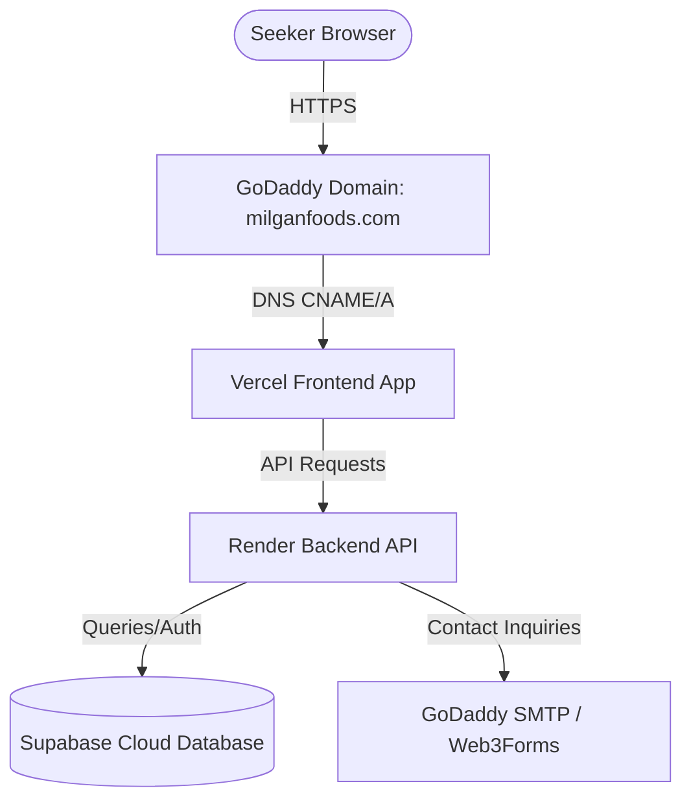

# Live Deployment Plan - Milgan Foods

This implementation plan details the step-by-step guide to deploying the Next.js frontend and Express backend, connecting them to the existing Supabase cloud database, and setting up your custom domain via GoDaddy.

---

## User Review Required

> [!IMPORTANT]
> Since we do not have direct access to your hosting credentials (Vercel, Render, GoDaddy), you will need to execute the cloud platform steps yourself. This guide provides the exact environment variables, configuration parameters, and DNS records you need to insert.

---

## Proposed Architecture

---

## Step-by-Step Deployment Instructions

### 1. Database (Supabase)
* Your Supabase database is already hosted in the cloud (`bxqtwqjulzpoohvwwhfs.supabase.co`).
* **Action**: No database migration is needed. The credentials in the backend `.env` are already pointing to this live database.

---

### 2. Backend Deployment (Render)
Render is recommended for hosting Node/Express backends. The codebase already points to `https://milgan-backend.onrender.com` as the default URL.

1. **Create an account** on [Render](https://render.com/).
2. Click **New +** > **Web Service**.
3. Connect your Git repository containing the code (or upload it).
4. Set the following fields in the Render dashboard:
   * **Root Directory**: `backend`
   * **Build Command**: `npm install`
   * **Start Command**: `node server.js`
5. Click **Advanced** and add these **Environment Variables**:
   | Key | Value | Description |
   | :--- | :--- | :--- |
   | `PORT` | `5000` | Port for the backend process |
   | `SUPABASE_URL` | `https://bxqtwqjulzpoohvwwhfs.supabase.co` | Your Supabase Project URL |
   | `SUPABASE_ANON_KEY` | `sb_publishable_akmmX8OvsuDe5YDTDGEz4g_Dtny30we` | Supabase Anon Key |
   | `JWT_SECRET` | *[Choose a secure random string]* | Key to sign admin session tokens |
   | `FRONTEND_URL` | `https://milganfoods.com` | Your custom domain (or Vercel URL) |
   | `WEB3FORMS_KEY` | `998953fe-8a59-41df-9d4f-611000d1c366` | Key for email forms |
   | `SMTP_HOST` | `smtpout.secureserver.net` | GoDaddy SMTP server |
   | `SMTP_PORT` | `465` | SSL Port |
   | `SMTP_USER` | `info@milganfoods.com` | Email user |
   | `SMTP_PASS` | `Milgan@Foods` | Email password |
6. Deploy the web service. Render will provide a URL (e.g., `https://milgan-backend.onrender.com`).

---

### 3. Frontend Deployment (Vercel)
Vercel is the native platform for Next.js and is optimal for speed, SEO, and global CDN caching.

1. **Create an account** on [Vercel](https://vercel.com/).
2. Click **Add New** > **Project** and import your Git repository.
3. In the project settings configuration:
   * **Framework Preset**: `Next.js`
   * **Root Directory**: `frontend`
4. Add the following **Environment Variable**:
   | Key | Value | Description |
   | :--- | :--- | :--- |
   | `NEXT_PUBLIC_API_URL` | *[Your Render URL from Step 2]* | Points the frontend code to your backend |
5. Click **Deploy**. Vercel will build and host your Next.js application, providing a default domain (e.g. `milgan.vercel.app`).

---

### 4. Custom Domain Setup (GoDaddy & Vercel)
To point your custom domain (e.g. `milganfoods.com`) to your live website:

1. In the **Vercel Dashboard**, go to **Settings** > **Domains**.
2. Add your domain name (e.g. `milganfoods.com` or `www.milganfoods.com`).
3. Vercel will show the **DNS Records** you need to add to GoDaddy. Typically:
   * For the apex domain (`milganfoods.com`): An **A Record** pointing to `76.76.21.21`.
   * For the subdomain (`www.milganfoods.com`): A **CNAME Record** pointing to `cname.vercel-dns.com`.
4. **Login to GoDaddy**:
   * Navigate to **Domain Portfolio** > Click on your domain > Click **DNS**.
   * Add/Edit the DNS records with the exact values Vercel gave you:
     * **Type**: `A`, **Name**: `@`, **Value**: `76.76.21.21`, **TTL**: `1 Hour`.
     * **Type**: `CNAME`, **Name**: `www`, **Value**: `cname.vercel-dns.com`, **TTL**: `1 Hour`.
5. Allow Vercel a few minutes to automatically generate and apply an SSL certificate.

---

## Verification Plan

### Manual Verification Checklist
- [ ] Open your domain (`milganfoods.com`) in the browser. Confirm that the gold preloader loads and redirects to the landing page.
- [ ] Test the contact form. Send an inquiry and check if it routes to your email successfully.
- [ ] Go to `/admin/login` and verify you can log in using your admin credentials.
- [ ] Inspect the console logs to confirm that all assets and API routes connect with no CORS issues.
